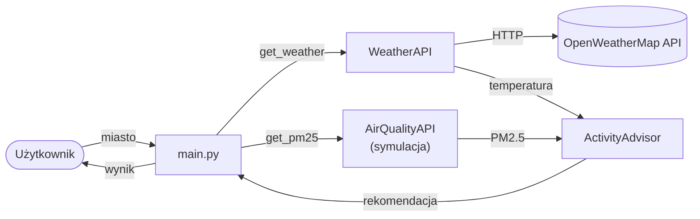

# EcoWeather-Planner 🌤️🏃‍♂️

## 📝 Opis projektu

**EcoWeather-Planner** to aplikacja konsolowa napisana w Pythonie, która pomaga użytkownikowi
podjąć decyzję o aktywnościach na świeżym powietrzu. Aplikacja pobiera dane o aktualnej pogodzie
(z **OpenWeatherMap API**) oraz dane o jakości powietrza (PM2.5). Na podstawie prostego algorytmu
oceny ryzyka system generuje spersonalizowany komunikat zdrowotny, np.:

> „Zostań w domu. Jakość powietrza jest bardzo zła!"

## 🏗️ Architektura projektu

Projekt został zaprojektowany zgodnie z zasadą **Single Responsibility Principle (SRP)**
oraz podziałem na warstwy:

- `src/weather_api.py` — odpowiada wyłącznie za komunikację HTTP z OpenWeatherMap i parsowanie odpowiedzi.
- `src/air_quality_api.py` — dostawca danych o jakości powietrza (PM2.5). **Obecnie symulacja
  (placeholder)** — zwraca wartość z realistycznego zakresu, gotowa do podmiany na realne API
  (OpenWeather Air Pollution / OpenAQ / Airly) bez zmian w pozostałej części aplikacji.
- `src/advisor.py` — czysta logika biznesowa (silnik decyzji), odizolowana od sieci i bibliotek
  zewnętrznych, co czyni ją w pełni testowalną offline.
- `main.py` — orkiestrator aplikacji; odpowiada za interakcję z użytkownikiem (I/O) i spięcie modułów.

### Przepływ danych



### Struktura katalogów

```
py_weather/
├── .env                  # klucz API (lokalny, w .gitignore)
├── .env.example          # szablon konfiguracji
├── .gitignore
├── main.py               # punkt wejścia / orkiestrator
├── requirements.txt
├── README.md
├── src/
│   ├── __init__.py
│   ├── weather_api.py
│   ├── air_quality_api.py
│   └── advisor.py
└── tests/
    ├── __init__.py
    ├── test_advisor.py
    └── test_weather.py
```

## 🚀 Jak uruchomić projekt

1. Sklonuj repozytorium i wejdź do katalogu:
   ```bash
   git clone https://github.com/TWOJ-LOGIN/ecoweather-planner.git
   cd ecoweather-planner
   ```

2. (Zalecane) utwórz i aktywuj środowisko wirtualne:
   ```bash
   python -m venv venv
   venv\Scripts\activate        # Windows
   # source venv/bin/activate   # Linux / macOS
   ```

3. Zainstaluj zależności:
   ```bash
   pip install -r requirements.txt
   ```

4. Skonfiguruj klucz API — skopiuj `.env.example` jako `.env` i wstaw swój klucz
   z [OpenWeatherMap](https://openweathermap.org/api):
   ```
   OPENWEATHER_API_KEY=twoj_klucz_api
   ```

5. Uruchom aplikację:
   ```bash
   python main.py
   ```

## ✅ Testy

W projekcie zaimplementowano testy jednostkowe przy użyciu frameworka **pytest**. Testują one
algorytm rekomendacji (`ActivityAdvisor`) dla różnych scenariuszy oraz klienta pogody
(`WeatherAPI`) z użyciem **mocków** — dzięki temu działają w pełni offline, bez prawdziwych
zapytań do API.

Uruchomienie:
```bash
pytest
```

## 🛠️ Wykorzystane technologie

- **Python 3.x**
- **requests** — zapytania HTTP do API
- **python-dotenv** — bezpieczne wczytywanie klucza API z pliku `.env`
- **pytest** — automatyzacja testów jednostkowych
- **OpenWeatherMap API** — zewnętrzne źródło danych pogodowych
- *(jakość powietrza — obecnie symulowana, gotowa pod realne API)*
